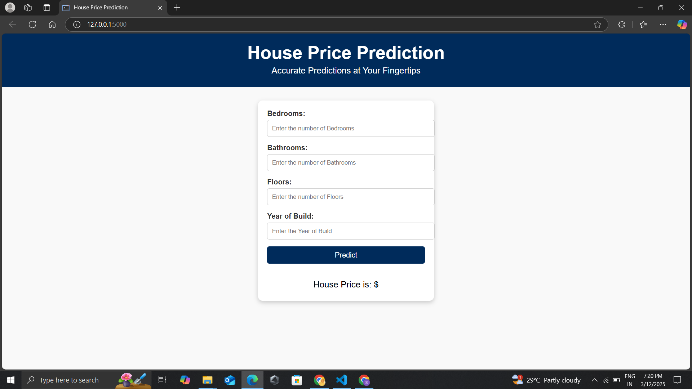
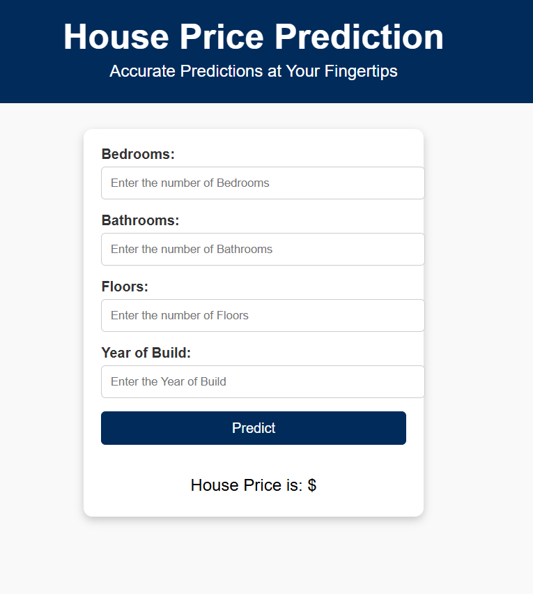
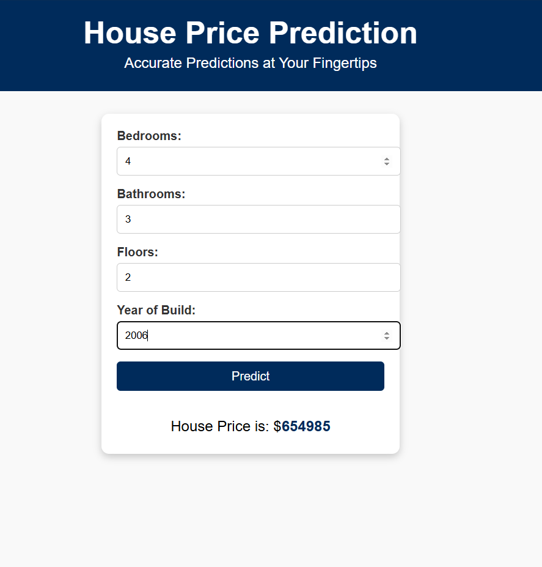

# House Price Prediction 


## Introduction
This project builds and deploys a machine learning model to predict house prices based on given features. The pipeline includes data preprocessing, model training, evaluation, and deployment using Flask. The API is containerized using Docker for easy deployment.Data Preprocessing & Feature Engineering
Steps Taken:

## Data Loading & Exploration

- Read the dataset using Pandas.
- Identified missing values and outliers.
- Checked data distribution and correlations.

## Handling Missing Values

- Categorical missing values → filled with mode (most frequent value).
- Numerical missing values → filled with mean.

## Feature Engineering

- Categorical Encoding: One-Hot Encoding (OHE) for categorical variables.
- "Feature Scaling:" Standardization (mean=0, std=1) for numerical columns.
- "Feature Selection:" Removed highly correlated features.

## Model Selection & Optimization

- Train-Test Split: 80% training, 20% testing.

### Model Choices:

- Linear Regression (Best Model chosen
- Decision Tree
- Random Forest Regressor 
- xg boost

### Hyperparameter Tuning:

- Used RandomizedSearchCV to optimize hyperparameters for Linear Regression
- Optimized parameters: Ridge and Lasso

### Model Evaluation:

#### Metrics used:
- RMSE (Root Mean Squared Error)
- MAE (Mean Absolute Error)
- R² Score (Coefficient of Determination)

### Best Model:

- Linear Regression performed best with optimized parameters.
- Model saved as best_linear_reg.pkl using Pickle.

## Deployment Strategy & API Usage Guide

### Deployment Steps

#### 1. Built Flask API (app.py)

- /predict endpoint receives JSON input and returns predicted price.

#### 2.Dockerization (Dockerfile)

-  Created a Docker container for portability.

#### 3.Running Locally:

-  Install dependencies:
```
 pip install -r requirements.txt
```
  
-  Run Flask app:
  ```
python app.py
```

#### 4.Test API using curl or Postman.

##### Testing the API
-  Using Postman (JSON Request)
-  POST Endpoint: http://127.0.0.1:5000/predict
-  Body: Send a JSON payload:
   json
  ```
{
  "bedrooms": 4,
  "bathrooms": 3,
  "floors": 2,
  "yr_built": 2001
}
 ```
- Response:
  json
  ```
  {
  "predicted_price": 340000
  }


#### 4.Running with Docker:

-  Build the image:
```
docker build -t house-price-api .
```
  
-  Run the container:
 ```
docker run -p 5000:5000 house-price-api
```
  
-  Access API at: http://localhost:5000/predict

## Preview






